# AZAM Radar: Autonomous Document Intelligence Pipeline

An event-driven document intelligence architecture designed to ingest unstructured live data streams, evaluate complex PDF documents, and force deterministic structured data persistence using securely constrained Large Language Models (LLMs).

## Architecture Overview

AZAM completely bypasses fragile regex parsing in favor of API-level MIME-type constraints. It evaluates inbound PDF documents against a strict internal criteria matrix, transfiguring conversational AI generation into structured database records with zero human intervention.

<p align="center">
  
</p>

## Core Engineering Principles

*   **Strict Bounds Enforcement:** LLMs are intrinsically nondeterministic text engines. AZAM secures the data extraction pipeline by invoking `application/json` boundaries directly at the request configuration layer, systematically neutralizing model hallucination and conversational filler.
*   **Zero-Regex Philosophy:** By utilizing semantic parsing over lexical string matching, the pipeline is entirely insulated against edge-case formatting variations in inbound supplier documents.
*   **Asynchronous Orchestration:** Designed to operate as a completely autonomous backend service, utilizing daemon infrastructure to pull, parse, and persist data asynchronously without constant HTTP polling overhead.

## System Topology

1.  **Ingestion Engine (`main.py`)**: Intercepts active network streams, sanitizing and decanning email headers and extracting raw binary attachments safely.
2.  **Intelligence Layer**: Streams byte-data into Google Gemini 3.5 Flash for comparative reasoning against a JSON profile schema. 
3.  **State Management (`schema.sql`)**: Manages evaluated entities in an ACID-compliant SQLite environment, preventing state overlaps or skipped records.
4.  **Presentation & Dispatch (`generate_dashboard.py` / `shortlist_bot.py`)**: Generates read-only operational telemetry and triggers downstream networking actions upon new record states.

## Local Configuration & Deployment

### 1. Environment Constraints
Initialize a `.env` configuration at the root directory to satisfy network and API dependencies:

```ini
GMAIL_USER=system_intake@example.com
GMAIL_PASS=oauth_application_password
GEMINI_API_KEY=api_key_string
```

### 2. Dependency Initialization
Build the local environment and assign SQLite schemas:

```bash
pip install -r requirements.txt
sqlite3 internships.db < schema.sql
```

### 3. Pipeline Execution
Trigger the ingestion loop standardly:
```bash
python main.py
```
*Note: To attach the pipeline to a background daemon, execute the included `install_service.sh` shell configuration.*
